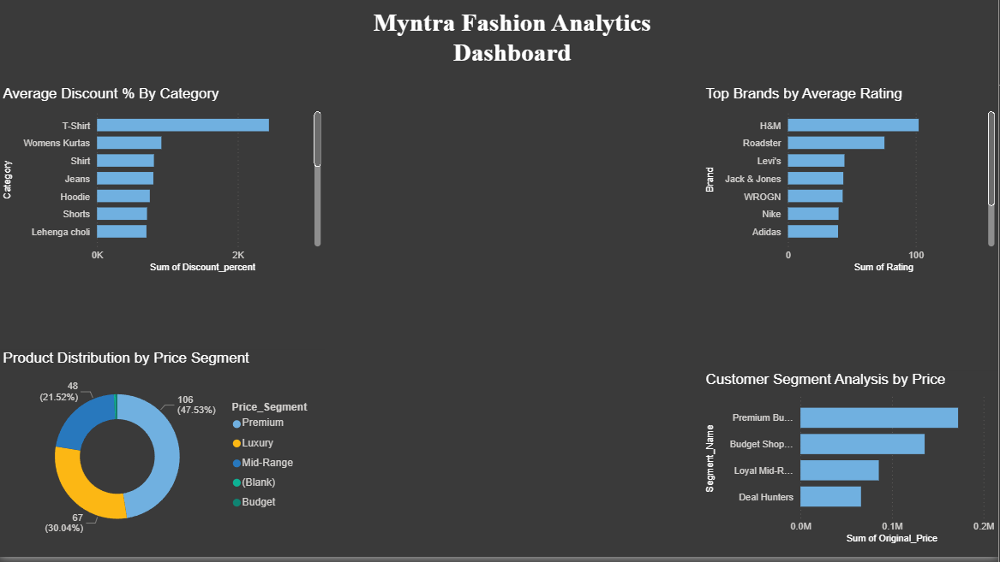

# 🛍 Myntra Fashion Market Analysis Dashboard

## 🔍 Project Overview
This project focuses on analyzing Myntra fashion product data to understand customer buying patterns, pricing strategies, discount behavior, and brand performance. The objective was to generate actionable insights that can help improve customer retention, optimize discount strategies, and increase profitability.

## 📌 My Contribution
- Collected product data manually from Myntra.com
- Cleaned and prepared the dataset for analysis
- Performed customer segmentation using K-Means Clustering
- Built an interactive Power BI dashboard
- Generated business insights and strategic recommendations

## 🛠 Tools Used
- Python
- Power BI
- Excel
- K-Means Clustering

## 📈 Key Insights
- Premium segment had the highest product count
- Female category received the highest average discount (55%)
- Premium buyers had the highest satisfaction rating (4.37)
- Deal hunters responded strongly to discounts above 75%
- Shubha Viysan Textile was identified as the highest-rated brand

## 📸 Dashboard Preview

## 📁 Files Included
- `myntra_final.xlsx`
- `Myntra_Consulting_Report.pdf`
- `Myntra_dashboard.pbix`

## 🚀 Conclusion
This project demonstrates how customer segmentation and pricing analysis can help fashion businesses improve discount strategies, strengthen customer loyalty, and maximize revenue opportunities through data-driven decisions.
